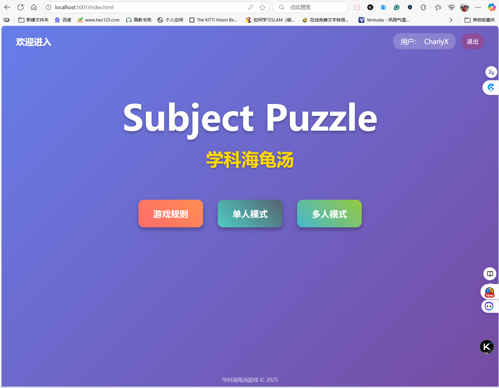
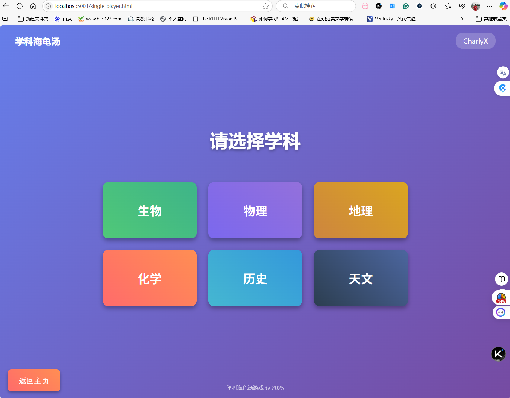
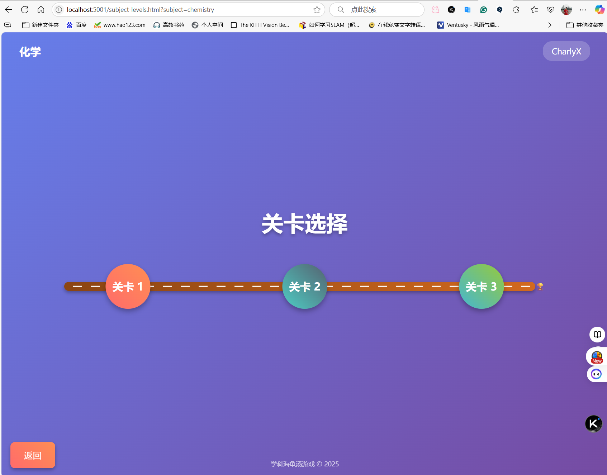
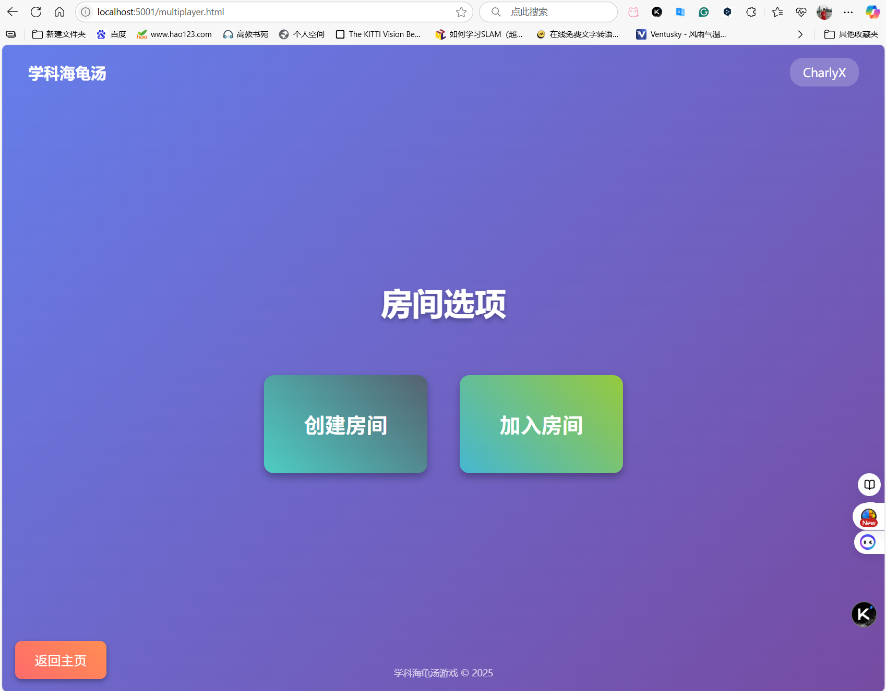
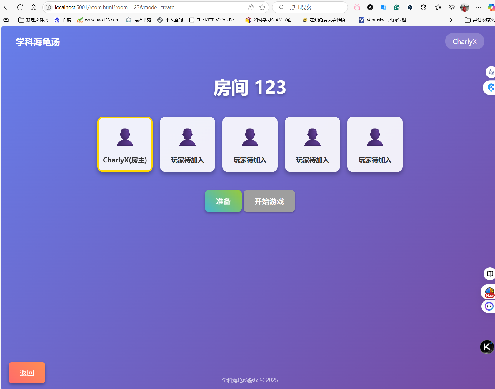
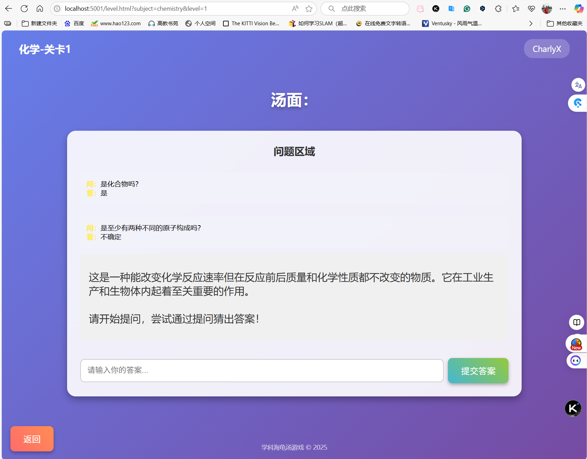

# 学科猜词海龟汤 (Subject Puzzle)

一个基于Qwen3大模型的智能学科猜谜游戏平台，支持多个学科方向的谜题，玩家通过提问来缩小答案范围，最终猜出正确答案。

## 大赛信息

- **大赛名称**：大连理工大学第一届Vibe Coding Hackathon“灵码杯”
- **参赛组别**：游戏万物赛道

## 赛题要求

游戏早已成为人类不可或缺的一部分，这些往往让大家觉得只是拿来娱乐的东西，实际上却传递了太多内容。游戏作者的价值观总是在潜移默化地影响所有游戏玩家，这让我们思考一个问题：我们可以通过游戏传递什么？传递一种价值、引导玩家学习一种方式，激发大家对某种事物的兴趣和热情……游戏只是一种形式，你可以把它做成学习的载体。本赛题要求作品必须是一个游戏，越新颖、越不局限于传统形式的游戏越会得到认可。

## 项目创意

学科猜词海龟汤是一款结合教育性和娱乐性的创新猜谜游戏，灵感来源于经典的'海龟汤'推理游戏。我们将其扩展到多个学科领域，让玩家在娱乐中学习知识，在学习中享受乐趣。

我们的创意核心是将游戏作为知识传递的载体，通过智能问答形式，让玩家在轻松愉快的游戏过程中学习到真实的学科知识。游戏的设计理念是：

1. **寓教于乐**：将学科知识融入游戏机制，让学习变得有趣
2. **智能互动**：利用Qwen3大模型提供智能化的问答体验
3. **知识传递**：每个谜题都包含真实、准确的学科知识
4. **持续学习**：通过游戏机制鼓励玩家不断探索和思考
5. **多学科覆盖**：涵盖多个学科领域，拓宽知识面

游戏不仅是一个娱乐工具，更是一个有效的学习平台，能够激发玩家对学科知识的兴趣和探索欲望。

## 实现功能

### 核心功能

1. **多学科支持**：支持天文、历史、地理、物理、化学、生物等学科方向
2. **智能问答**：基于Qwen3大模型提供智能化问答体验，支持根据问题内容提供准确回答
3. **用户系统**：完整的用户注册、登录、积分累计功能
4. **提示系统**：每道题可获取一次提示帮助解题
5. **积分系统**：根据答题表现累计积分，鼓励最佳表现
6. **单人和多人游戏**：支持单人挑战和多人协作/对战模式
7. **准备状态**：在多人游戏中，玩家可以标记准备状态，房主确认所有玩家准备就绪后开始游戏
8. **汤面描述**：每个谜题都有详细的背景描述，帮助玩家理解游戏情境
9. **答案判断**：实时判断玩家是否猜中答案
10. **游戏记录**：记录玩家的游戏表现，包括得分和用时等

### 技术实现

1. **Qwen3大模型集成**：完整集成了Qwen3大模型，能够根据学科和关卡生成谜题，提供智能回答和提示
2. **关卡系统**：为每个学科设计了多个关卡，难度逐渐增加
3. **前后端分离**：前端使用原生HTML/CSS/JavaScript，后端使用Node.js + Express
4. **实时通信**：基于HTTP长轮询实现的简易实时状态同步
5. **认证系统**：JWT Token认证，确保用户安全
6. **数据库**：MongoDB存储用户数据、游戏会话和房间信息

## 运行与部署

### 环境要求

- Node.js >= 14.x
- MongoDB >= 4.x
- Qwen3大模型API密钥（可选，本地题库作为备选方案）

### 安装步骤

1. 克隆项目代码：
```bash
git clone https://github.com/CharlyX-Lee/Subject-Puzzle
cd subject-puzzle
```

2. 安装依赖：
```bash
npm install
```

此步骤将安装以下依赖：
- Express：Web框架
- Mongoose：MongoDB对象建模
- JWT：JSON Web Token认证
- Bcrypt.js：密码加密
- Dotenv：环境变量管理
- Node-fetch：用于调用Qwen3大模型API
- Nodemon（开发依赖）：开发环境自动重启

3. 配置环境变量：
```bash
# 复制环境变量模板
cp .env.example .env

# 编辑 .env 文件，配置 MongoDB 连接和 Qwen3 API 密钥
```

.env 文件中包含以下重要配置：
```
# 服务器端口
PORT=5001
ADMIN_PORT=5000

# MongoDB连接字符串
MONGODB_URI=mongodb://localhost:27017/guessing-game

# JWT密钥
JWT_SECRET=guessing_game_secret_key_2023

# Qwen3大模型API配置
QWEN_API_KEY=your_qwen3_api_key （此处应更改为自己的API_KEY）
QWEN_ACCESS_KEY=your_qwen3_access_key （此处应更改为自己的API_KEY）
QWEN_SECRET_KEY=your_qwen3_secret_key （此处应更改为自己的API_KEY）
QWEN_API_ENDPOINT=https://dashscope.aliyuncs.com/compatible-mode/v1/chat/completions
```

4. 测试 MongoDB 连接：
```bash
node test-mongodb.js
```

5. 初始化数据库（创建默认管理员账户）：
```bash
npm run init-db
```

6. 启动应用：
```bash
# 启动游戏端（端口5001）
npm start

# 在另一个终端启动管理端（端口5000）
npm run start:admin
```

或者使用开发模式：
```bash
# 启动游戏端开发模式
npm run dev

# 在另一个终端启动管理端开发模式
npm run dev:admin
```

7. 访问应用：
- 游戏端：打开浏览器访问 http://localhost:5001
- 管理端：打开浏览器访问 http://localhost:5000

## 可执行成果

本项目为Web应用，无需编译，直接通过Node.js运行。部署时只需将整个项目文件夹上传到服务器，安装依赖并配置环境变量即可。

### 本地运行

本地运行时，游戏可通过以下链接访问：
- http://localhost:5001 - 游戏端
- http://localhost:5000 - 管理端

### 生产环境部署

要部署到生产环境，请执行以下步骤：

1. 将项目上传到服务器
2. 安装Node.js和MongoDB
3. 执行 `npm install` 安装依赖
4. 配置.env文件，设置生产环境的MongoDB连接和Qwen3 API密钥
5. 使用PM2等进程管理工具启动服务
6. 配置Nginx反向代理
7. 配置HTTPS证书

## 默认管理员账户

初始化脚本会自动创建一个默认管理员账户：
- 用户名: admin
- 邮箱: admin@example.com
- 密码: admin123
- 角色: admin

⚠️ **重要提醒**: 首次登录后请立即更改默认密码！

## 项目结构

```
subject-puzzle/
├── models/                 # 数据模型
│   ├── User.js            # 用户模型
│   └── GameSession.js     # 游戏会话模型
├── routes/                 # 路由
│   ├── auth.js            # 认证路由
│   ├── game.js            # 游戏路由
│   └── admin.js           # 管理员路由
├── public/                 # 前端静态文件
│   ├── index.html         # 首页
│   ├── login.html         # 登录页面
│   ├── register.html      # 注册页面
│   ├── game.html          # 游戏页面
│   └── admin.html         # 管理员页面
├── .env                   # 环境变量配置
├── server.js              # 游戏端服务器入口文件
├── admin.js               # 管理端服务器入口文件
├── test-mongodb.js        # MongoDB 连接测试脚本
├── init-db.js             # 数据库初始化脚本
├── package.json           # 项目配置文件
└── README.md              # 项目说明文档
```

## API 接口

### 认证相关

- `POST /api/auth/register` - 用户注册
- `POST /api/auth/login` - 用户登录
- `GET /api/auth/me` - 获取当前用户信息

### 游戏相关

- `POST /api/game/start` - 开始新游戏
- `POST /api/game/ask/:sessionId` - 提问
- `POST /api/game/hint/:sessionId` - 获取提示
- `GET /api/game/status/:sessionId` - 获取游戏状态

### 管理员相关

- `GET /api/admin/users` - 获取所有用户
- `GET /api/admin/users/:id` - 获取特定用户信息
- `PUT /api/admin/users/:id/role` - 更新用户角色
- `DELETE /api/admin/users/:id` - 删除用户
- `GET /api/admin/stats` - 获取统计信息

## 游戏流程

1. 用户选择学科方向
2. 系统根据学科生成谜题
3. 用户通过提问缩小答案范围
4. 用户可获取一次提示帮助解题
5. 用户猜出正确答案完成游戏
6. 根据答题表现累计积分

## 集成通义千问大模型

本项目设计时已考虑与通义千问大模型的集成，只需配置相应的 API 密钥和端点即可实现智能问答功能。

在实际部署时，请将 `.env` 文件中的 `QWEN_API_KEY` 和 `QWEN_API_ENDPOINT` 替换为真实的 API 密钥和端点地址。

## 后续优化建议

1. 实现与通义千问 API 的真实集成
2. 增加更多学科和题库
3. 优化前端界面和用户体验
4. 添加排行榜功能
5. 增加游戏难度等级
6. 实现多语言支持

## 许可证

本项目仅供大赛参考和日常学习使用，严禁商业用途。

## 常见问题与故障排除

### 常见问题

1. **Q：启动应用时出现MongoDB连接失败错误**
   A：请检查MongoDB服务是否已启动，检查`.env`文件中的MONGO_URI配置是否正确

2. **Q：准备状态无法同步显示**
   A：检查前端定时器是否正常工作，确认服务器端API是否能正确返回更新的房间状态

3. **Q：多人游戏功能无法正常使用**
   A：确保所有客户端都能正常访问服务器API，检查跨域设置是否正确

4. **Q：游戏页面样式显示异常**
   A：确认静态文件路径是否正确，检查浏览器控制台是否有404错误

### 故障排除

1. **检查MongoDB连接**
```bash
node test-mongodb.js
```

2. **查看服务日志**
在开发模式下直接查看终端输出，生产环境建议配置日志文件

3. **验证API接口**
使用Postman或curl测试API接口是否正常工作

4. **检查浏览器控制台**
打开浏览器开发者工具，查看是否有JavaScript错误或网络请求失败

## 运行与部署

### 本地开发环境

本项目采用双端口架构：
- **管理端**：http://localhost:5000 (管理员面板)
- **游戏端**：http://localhost:5001 (用户游戏界面)

启动应用：
```bash
# 启动游戏端（端口5001）
npm start

# 在另一个终端启动管理端（端口5000）
npm run start:admin
```

或者使用开发模式（自动重启）：
```bash
# 启动游戏端开发模式
npm run dev

# 在另一个终端启动管理端开发模式
npm run dev:admin
```

### 生产环境部署

1. **构建静态文件**：将`public/`目录下的文件作为静态资源部署
2. **配置环境变量**：确保在`.env`文件中正确配置了生产环境的数据库连接和密钥
3. **启动服务**：使用PM2等进程管理工具启动`server.js`和`admin.js`

```
# 安装PM2
npm install -g pm2

# 启动游戏端服务
pm2 start server.js --name "subject-puzzle-game" --port 5001

# 启动管理端服务
pm2 start admin.js --name "subject-puzzle-admin" --port 5000
```

4. **配置反向代理**：使用Nginx或Apache配置反向代理，将域名指向对应服务

### 访问方式

项目部署成功后，可以通过以下方式访问：

- **游戏端**：http://your-domain.com (或指定的域名/IP地址)
- **管理端**：http://your-domain.com:5000 (建议通过反向代理配置为子路径)

### 可执行文件发布

本项目为Node.js Web应用，无需单独发布可执行文件。所有源代码可通过Git仓库获取，最新版本可在GitHub Releases页面下载。

## 项目截图













> 注意：项目根目录下`screenshots/`文件夹中提供了示例截图，展示了多人游戏房间、准备状态显示等核心功能界面。

## 未来计划

1. **语音交互**：增加语音输入功能，提升游戏互动体验
2. **移动端适配**：优化移动端界面，支持手机和平板设备
3. **更多学科题库**：持续扩展各学科题库数量和质量
4. **社交分享**：增加游戏成绩分享功能
5. **成就系统**：添加游戏成就和排行榜功能
6. **AI难度调节**：根据玩家水平智能调节谜题难度
7. **多人协作模式**：增加团队协作解谜模式，提升互动乐趣
